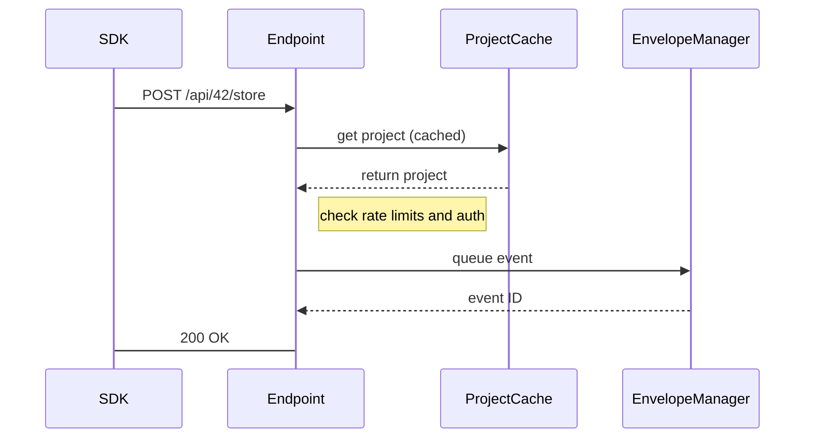

<!--MERMAID {width:100}-->

<!--MCONTENT {content: sequenceDiagram  
SDK->>Endpoint: POST /api/42/store  
Endpoint ->> `ProjectCache`[<sup id="ZGvXjI">↓</sup>](#f-ZGvXjI): get project (cached)  
`ProjectCache`[<sup id="ZGvXjI">↓</sup>](#f-ZGvXjI) \-\-\>> Endpoint: return project  
Note right of Endpoint: check rate limits and auth  
Endpoint ->> EnvelopeManager: queue event  
EnvelopeManager \-\-\>> Endpoint: event ID  
Endpoint -> SDK: 200 OK} --->

<br/>

<!-- THIS IS AN AUTOGENERATED SECTION. DO NOT EDIT THIS SECTION DIRECTLY -->
### Swimm Note

<span id="f-ZGvXjI">ProjectCache</span>[^](#ZGvXjI) - "relay-server/src/actors/project_cache.rs" L47
```renderscript
pub struct ProjectCache {
```

<br/>

This file was generated by Swimm. [Click here to view it in the app](https://app.swimm.io/repos/Z2l0aHViJTNBJTNBcmVsYXklM0ElM0Fzd2ltbWlv/docs/pb7i7).